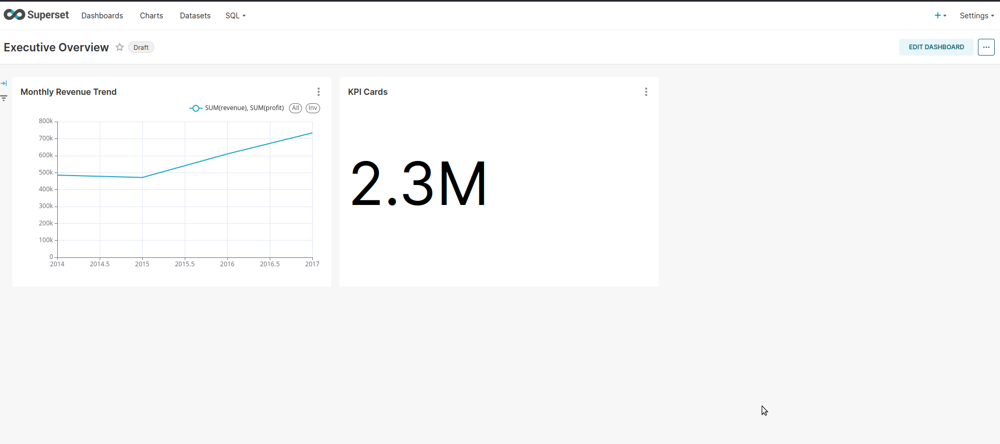
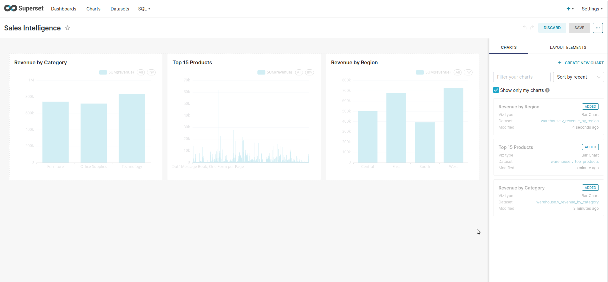

[](https://github.com/adnanphp/openbi/actions/workflows/ci.yml)

# OpenBI

OpenBI is an end-to-end open-source Business Intelligence and Analytics platform.
It ingests retail transaction data, models it into a star-schema warehouse in
PostgreSQL, exposes KPIs and ML-driven insights through Apache Superset
dashboards, and serves metrics via a FastAPI layer.

## Status

- [x] **Phase 0** — repo scaffold, dataset
- [x] **Phase 1** — EDA, KPI candidate list (`docs/kpi_candidates.md`)
- [x] **Phase 2** — Postgres star schema, ETL pipeline, KPI views
- [x] Phase 3 — Superset dashboards (Executive, Sales)
- [ ] Phase 4 — RFM segmentation + sales forecasting
- [ ] Phase 5 — API, Airflow, tests, CI

## Stack

PostgreSQL · Python · pandas · SQLAlchemy · Apache Superset · scikit-learn · FastAPI · Docker

## Quickstart

```bash
make up      # start Postgres
make init    # run ETL: CSV → staging → warehouse
make psql    # open psql shell
Warehouse schema
text
staging.superstore_raw   ← raw CSV (all text)
     ↓
staging.superstore       ← typed view
     ↓
warehouse.dim_customer
warehouse.dim_product
warehouse.dim_region
warehouse.dim_ship_mode
warehouse.dim_date
warehouse.fact_sales
     ↓
warehouse.v_monthly_revenue
warehouse.v_revenue_by_category
warehouse.v_revenue_by_region
warehouse.v_top_products
warehouse.v_customer_rfm
Verified totals
Metric	Value
Fact rows	9,994
Revenue	$2,297,200.86
Profit	$286,397.02
Customers	793
Products	1,862

## Dashboards

- **Executive Overview** — Revenue, Profit, Orders, Monthly trend
  

- **Sales Intelligence** — Category, Product, Region breakdowns
  

## Access

After `make up` and `make init`:

| Service | URL | Credentials |
|---|---|---|
| Superset | http://localhost:8088 | admin / admin |
| Postgres | localhost:5432 | openbi / openbi |

## Key Insights from ML Layer

### RFM Customer Segmentation (KMeans, k=5, rule-based labels)

| Segment | Customers | Avg Recency | Avg Frequency | Avg Monetary |
|---|---:|---:|---:|---:|
| Champions | 106 | 25 days | 9.3 | $5,288 |
| At Risk | 102 | 220 days | 7.8 | $4,400 |
| Loyal Customers | 92 | 55 days | 8.6 | $3,426 |
| Potential Loyalists | 116 | 27 days | 6.2 | $2,731 |
| Need Attention | 221 | 167 days | 5.4 | $2,297 |
| New Customers | 39 | 25 days | 3.3 | $1,421 |
| Lost | 117 | 386 days | 3.4 | $794 |

**Actionable finding:** the **At Risk** segment represents **$449K of historical revenue**
across 102 customers who haven't purchased in ~7 months. Highest-priority
win-back cohort.

### Sales Forecasting

| Model | MAPE | RMSE |
|---|---:|---:|
| **ETS (Holt-Winters)** | **15.87%** | 15,885 |
| XGBoost (lag features) | 28.85% | 34,769 |
| Baseline (moving avg) | 38.66% | 41,460 |

ETS wins on a 48-month series. XGBoost underperforms due to limited training
signal — a common result for short retail time series.
