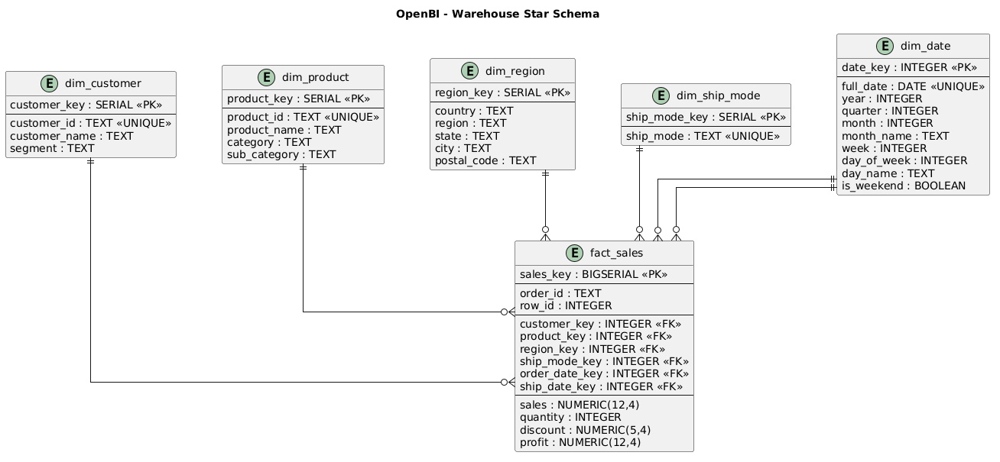

# 📊 OpenBI — End-to-End Business Intelligence & Analytics Platform

[](https://github.com/adnanphp/openbi/actions/workflows/ci.yml)


> **An open-source, end-to-end Business Intelligence platform combining data engineering, analytics, machine learning, forecasting, dashboards, APIs, testing, and containerized deployment.**

OpenBI transforms retail transaction data into a production-style analytics platform.

The system:

**CSV → ETL → PostgreSQL Data Warehouse → Analytics → ML → Forecasting → Superset Dashboards → FastAPI**

---

## ✨ Highlights

| Capability             |                 Result |
| ---------------------- | ---------------------: |
|  Records ingested    |              **9,994** |
|  Total revenue       |      **$2,297,200.86** |
|  Total profit        |        **$286,397.02** |
|  Warehouse tables   | **6 dimensions/facts** |
|  KPI views           |                  **5** |
|  Customer segments   |                  **7** |
|  Forecasting horizon |          **48 months** |
|  Superset dashboards |                  **3** |
|  Automated tests     |                 **27** |
|  CI                  |     **GitHub Actions** |

###  Key Results

* **RFM + KMeans** identifies **7 actionable customer segments**
* **At Risk customers** represent approximately **$449K** in historical revenue
* **ETS forecasting achieves 15.87% MAPE**
* **FastAPI** exposes KPIs, customer segments, and forecasts
* **Apache Superset** provides Executive, Sales, and Customer dashboards
* Complete pipeline can be reproduced with:

```bash
make init
```

---

#  Architecture

```text
                         ┌──────────────────────────┐
                         │  data/raw/superstore.csv │
                         └─────────────┬────────────┘
                                       │
                                       ▼
                         ┌──────────────────────────┐
                         │     Python Ingestion     │
                         │  • Translation           │
                         │  • Type coercion         │
                         │  • Validation            │
                         └─────────────┬────────────┘
                                       │
                                       ▼
                    ┌─────────────────────────────────┐
                    │      PostgreSQL Staging         │
                    │      staging.superstore_raw     │
                    └────────────────┬────────────────┘
                                     │
                                     ▼
                  ┌──────────────────────────────────────┐
                  │       PostgreSQL Data Warehouse      │
                  │                                      │
                  │          ⭐ Star Schema               │
                  │                                      │
                  │  dim_customer    dim_product         │
                  │  dim_region      dim_ship_mode       │
                  │  dim_date        fact_sales           │
                  └──────────────────┬───────────────────┘
                                     │
              ┌──────────────────────┼──────────────────────┐
              │                      │                      │
              ▼                      ▼                      ▼
      ┌────────────────┐    ┌─────────────────┐    ┌─────────────────┐
      │   KPI Layer    │    │  ML Segmentation│    │  ML Forecasting │
      │                │    │                 │    │                 │
      │ Revenue        │    │ RFM             │    │ Baseline        │
      │ Profit         │    │ KMeans          │    │ ETS             │
      │ Category       │    │ 7 segments      │    │ XGBoost         │
      │ Region         │    │                 │    │                 │
      └───────┬────────┘    └────────┬────────┘    └────────┬────────┘
              │                      │                      │
              └──────────────────────┼──────────────────────┘
                                     │
                    ┌────────────────┴────────────────┐
                    │                                 │
                    ▼                                 ▼
          ┌──────────────────┐             ┌──────────────────┐
          │ Apache Superset  │             │     FastAPI      │
          │                  │             │                  │
          │ Executive        │             │ /kpis            │
          │ Sales            │             │ /customers       │
          │ Customer         │             │ /forecasts       │
          └──────────────────┘             └──────────────────┘
```

---

#  Technology Stack

| Layer                | Technologies            |
| -------------------- | ----------------------- |
| **Language**         | Python 3.12             |
| **Database**         | PostgreSQL              |
| **ORM / SQL**        | SQLAlchemy              |
| **BI / Dashboards**  | Apache Superset         |
| **Machine Learning** | scikit-learn, XGBoost   |
| **Forecasting**      | statsmodels             |
| **API**              | FastAPI                 |
| **Containers**       | Docker / Docker Compose |
| **Testing**          | pytest                  |
| **CI/CD**            | GitHub Actions          |
| **Orchestration**    | Apache Airflow          |
| **Data Processing**  | Pandas / NumPy          |

---

#  Quickstart

## Prerequisites

* Docker
* Docker Compose
* Python 3.12
* `make`

### 1. Clone

```bash
git clone https://github.com/adnanphp/openbi.git
cd openbi
```

### 2. Install dependencies

```bash
pip install -r requirements.txt
pip install -e .
```

### 3. Start PostgreSQL + Superset

```bash
make up
```

### 4. Run ETL

```bash
make etl
```

This performs:

```text
CSV
 ↓
Validation
 ↓
Staging
 ↓
Star Schema
 ↓
KPI Views
```

### 5. Run machine learning

```bash
make ml
```

This runs:

```text
RFM Analysis
     ↓
KMeans Segmentation

Sales History
     ↓
Baseline / ETS / XGBoost
     ↓
Forecast Selection
```

### 6. Explore the platform

**Apache Superset**

```text
http://localhost:8088
```

Default development credentials:

```text
Username: admin
Password: admin
```

**FastAPI Swagger**

```text
http://localhost:8000/docs
```

---

# ⚡ One-Command Reproduction

Run the complete pipeline:

```bash
make init
```

Additional commands:

```bash
make test      # Run test suite
make cov       # Tests + coverage
make clean     # Remove containers and volumes
```

---

# 📈 Business Intelligence Results

## Revenue & Profit — 2014–2017

| Metric           |             Value |
| ---------------- | ----------------: |
|  Total Revenue | **$2,297,200.86** |
|  Total Profit  |   **$286,397.02** |
|  Profit Margin |        **12.47%** |
|  Orders        |         **5,009** |
|  Customers     |           **793** |
|  Products      |         **1,862** |

---

#  Customer Segmentation

OpenBI uses **RFM analysis + KMeans clustering** to identify customer behavior patterns.

### RFM Features

* **Recency** — how recently the customer purchased
* **Frequency** — how often the customer purchased
* **Monetary** — how much the customer spent

KMeans is applied to standardized RFM features, followed by rule-based business labels.

### Segments

| Segment                | Customers | Avg. Recency | Avg. Frequency | Avg. Monetary |
| ---------------------- | --------: | -----------: | -------------: | ------------: |
|  Champions           |       106 |      25 days |            9.3 |        $5,288 |
|  At Risk             |       102 |     220 days |            7.8 |        $4,400 |
|  Loyal Customers     |        92 |      55 days |            8.6 |        $3,426 |
|  Potential Loyalists |       116 |      27 days |            6.2 |        $2,731 |
|  Need Attention      |       221 |     167 days |            5.4 |        $2,297 |
|  New Customers       |        39 |      25 days |            3.3 |        $1,421 |
|  Lost                |       117 |     386 days |            3.4 |          $794 |

###  Business Insight

The **At Risk** segment contains **102 customers** representing approximately **$449K in historical revenue**.

These customers previously demonstrated relatively high purchasing frequency but have not purchased recently, making the segment particularly relevant for customer-retention and win-back analysis.

---

#  Sales Forecasting

OpenBI evaluates multiple forecasting approaches:

```text
Historical Sales
       │
       ├──────────────► Moving Average Baseline
       │
       ├──────────────► ETS / Holt-Winters
       │
       └──────────────► XGBoost + Lag Features
```

### Model Comparison

| Model                 |       MAPE |       RMSE |
| --------------------- | ---------: | ---------: |
| 🥇 ETS / Holt-Winters | **15.87%** | **15,885** |
| XGBoost               |     28.85% |     34,769 |
| Moving Average        |     38.66% |     41,460 |

The pipeline automatically evaluates candidate models and stores the forecasting results.

> **Observation:** ETS performs strongly on this relatively short historical time series, while the tree-based XGBoost model has less historical signal available for learning.

---

# 🌐 FastAPI

OpenBI exposes analytics through a REST API with automatically generated Swagger documentation.

Start the API:

```bash
uvicorn openbi.api.main:app --reload --port 8000
```

Swagger:

```text
http://localhost:8000/docs
```

### API Endpoints

| Endpoint                    | Description              |
| --------------------------- | ------------------------ |
| `GET /health`               | Health check             |
| `GET /kpis/executive`       | Executive KPIs           |
| `GET /kpis/monthly-revenue` | Monthly revenue & profit |
| `GET /kpis/by-category`     | Revenue by category      |
| `GET /customers/segments`   | RFM customer segments    |
| `GET /forecasts/latest`     | Latest selected forecast |
| `GET /forecasts/models`     | All candidate forecasts  |

### Example

```bash
curl -s http://localhost:8000/customers/segments | jq
```

Example response:

```json
[
  {
    "cluster_label": "Champions",
    "customers": 106,
    "avg_monetary": 5287.72
  },
  {
    "cluster_label": "At Risk",
    "customers": 102,
    "total_monetary": 448760.00
  }
]
```

---

# 🗄️ Data Warehouse

OpenBI follows a **star-schema architecture**.

## Staging

```text
staging.superstore_raw
    └── Raw source data

staging.superstore
    └── Typed staging view
```

## Warehouse

```text
warehouse.dim_customer
warehouse.dim_product
warehouse.dim_region
warehouse.dim_ship_mode
warehouse.dim_date

warehouse.fact_sales
```

## Analytics Views

```text
warehouse.v_monthly_revenue
warehouse.v_revenue_by_category
warehouse.v_revenue_by_region
warehouse.v_top_products
warehouse.v_customer_rfm
```

## ML Outputs

```text
warehouse.customer_segments
warehouse.sales_forecast
warehouse.v_forecast_vs_actual
```

---

# 📊 Apache Superset

The project includes **three BI dashboards**:

### 🏢 Executive Dashboard

High-level business KPIs:

* Revenue
* Profit
* Profit margin
* Orders
* Average order value
* Monthly performance

### 📈 Sales Dashboard

* Revenue trends
* Category performance
* Regional performance
* Top products
* Forecast vs actual

### 👥 Customer Dashboard

* RFM distributions
* Customer segments
* Segment revenue
* Customer behavior

---

# 🧪 Testing & Quality

OpenBI includes automated testing across multiple layers.

```text
tests/
├── unit/
├── integration/
└── data_quality/
```

### Test Coverage

| Layer                 | Scope                                      |
| --------------------- | ------------------------------------------ |
| `tests/unit/`         | Forecasting, RFM scoring, KPI calculations |
| `tests/integration/`  | Warehouse totals, API endpoints            |
| `tests/data_quality/` | Nulls, uniqueness, referential integrity   |

Run tests:

```bash
pytest tests -v
```

### Current Status

```text
27 tests
    ↓
GitHub Actions
    ↓
     ✅ CI GREEN
```

---

# 🐳 Full Docker Stack

Start the complete environment:

```bash
docker compose up -d
```

| Service    |   Port | Purpose                            |
| ---------- | -----: | ---------------------------------- |
| PostgreSQL | `5432` | Data warehouse + Superset metadata |
| Superset   | `8088` | BI dashboards                      |
| FastAPI    | `8000` | Analytics REST API                 |
| Airflow    | `8080` | Optional DAG orchestration         |

---

# 📁 Repository Structure

```text
openbi/
│
├── README.md
├── LICENSE
├── Makefile
├── requirements.txt
├── pyproject.toml
├── docker-compose.yml
│
├── data/
│   └── raw/
│       └── superstore.csv
│
├── src/
│   └── openbi/
│       ├── ingestion/
│       │   └── CSV → staging
│       │
│       ├── etl/
│       │   └── pipeline orchestration
│       │
│       ├── analytics/
│       │   ├── rfm/
│       │   └── kpis/
│       │
│       ├── ml/
│       │   ├── segmentation/
│       │   └── forecasting/
│       │
│       ├── api/
│       │   └── FastAPI service
│       │
│       └── orchestration/
│           └── dags/
│
├── sql/
│   ├── ddl/
│   ├── transforms/
│   └── views/
│
├── docker/
│   ├── postgres/
│   └── superset/
│
├── tests/
│   ├── unit/
│   ├── integration/
│   └── data_quality/
│
├── notebooks/
│   └── EDA / RFM exploration
│
└── docs/
    └── images/
        └── dashboard screenshots
```

---

# 🧠 Design Decisions

### 1. Historical RFM Anchor

RFM recency is anchored to the **last order in the dataset**, rather than `CURRENT_DATE`.

This prevents historical customers from incorrectly appearing extremely stale when analyzing an older dataset.

---

### 2. Data Translation at Ingestion

The Portuguese Superstore variant is translated to English during ingestion.

```text
Raw CSV
   ↓
load_csv.py
   ↓
English + typed data
   ↓
SQL / Analytics
```

This keeps downstream SQL and analytics readable.

---

### 3. Business-Friendly Segment Labels

KMeans clusters receive **rule-based business labels** rather than relying on arbitrary cluster IDs.

For example:

```text
Cluster 0 ❌
Cluster 1 ❌
Cluster 2 ❌

Champions       ✅
At Risk         ✅
Loyal Customers ✅
```

This makes ML results easier to communicate to business users.

---

### 4. Idempotent Pipeline

The pipeline is designed to be safely re-run.

SQL operations use patterns such as:

```sql
CREATE TABLE IF NOT EXISTS ...
```

and controlled cleanup with:

```sql
DROP ... CASCADE
```

This supports reproducible development and testing.

---

# 🔄 End-to-End Workflow

```text
             RAW DATA
                │
                ▼
        ┌───────────────┐
        │   Ingestion   │
        └───────┬───────┘
                │
                ▼
        ┌───────────────┐
        │    Staging    │
        └───────┬───────┘
                │
                ▼
        ┌───────────────┐
        │ Star Schema   │
        └───────┬───────┘
                │
       ┌────────┼─────────┐
       ▼        ▼         ▼
     KPIs      RFM     Forecasting
       │        │         │
       └────────┼─────────┘
                │
        ┌───────┴────────┐
        ▼                ▼
   Superset           FastAPI
   Dashboards            API
```

---

# 🎯 Project Goals

OpenBI demonstrates an end-to-end workflow for building a modern analytics platform:

* ✅ Data ingestion
* ✅ Data validation
* ✅ ETL
* ✅ Dimensional modeling
* ✅ PostgreSQL data warehouse
* ✅ Business KPI development
* ✅ Customer segmentation
* ✅ Machine-learning forecasting
* ✅ REST API development
* ✅ Interactive BI dashboards
* ✅ Automated testing
* ✅ CI/CD
* ✅ Dockerized deployment
* ✅ Reproducible pipelines

---

# 📌 Project Status

```text
████████████████████████████████████████  Production-style MVP
```

The platform is designed as a portfolio project demonstrating **Data Engineering + Business Intelligence + Machine Learning + Backend/API Engineering + DevOps** in one reproducible system.

---

# 📄 License

This project is licensed under the **MIT License**.

---

<p align="center">
  <b>OpenBI</b> · Open-source Business Intelligence & Analytics
  <br>
  Built with Python, PostgreSQL, ML, FastAPI, Superset & Docker
</p>


CI includes a fresh-venv import check — prevents "works on my machine" class bugs.

 License
MIT

## 🗄️ Warehouse Schema



## 🔥 Big Data Extension (v2)

OpenBI scales from 10K rows (v1, Postgres) to **100M+ rows** (v2, Delta Lake + Spark)
with the same star schema, dashboards, and API.

See [docs/architecture_bigdata.md](docs/architecture_bigdata.md) for the full architecture.

**Stack:** Apache Spark · PySpark · Spark SQL · Delta Lake · Parquet · Airflow · PostgreSQL · Docker

**Run:**

```bash
docker compose -f docker-compose.yml -f docker-compose.bigdata.yml up -d
./spark/run_job.sh jobs/ingest_to_bronze.py

---

## ✅ Full v2 Roadmap Complete

| Phase | Deliverable | Status |
|---|---|---|
| A | Spark + Delta Lake foundation (1M-row Bronze) | ✅ |
| B | Silver star schema (5 dims + 1 fact, partitioned by year) | ✅ |
| C | Gold aggregates → Postgres serving layer | ✅ |
| D | Spark MLlib RFM + KMeans + forecasting | ✅ |
| E | Airflow orchestration (daily / weekly / hourly DAGs) | ✅ |

### Metrics

| Layer | Rows | Notes |
|---|---:|---|
| Bronze (Delta) | 1,000,000 | raw, partitioned by category |
| Silver (Delta) | 1,000,000 | star schema, partitioned by year |
| Gold (Delta) | 1,251 | 5 pre-aggregated KPI tables |
| `warehouse_big` (Postgres) | 1,251 | same 5 tables, JDBC-published |
| `customer_segments` | 800 | 7 RFM segments |
| `sales_forecast` | 18 | 3 models × 6 months |

### Verified end-to-end

- **34 tests** (13 silver + 12 gold + 9 ml)
- **CI green** on every push
- **Airflow** at `http://localhost:8090` — 3 DAGs, `openbi_smoke` runs green
- **v1 vs v2** coexist in Postgres:
  - `warehouse` (10K rows) → $2,297,200.86
  - `warehouse_big` (1M rows) → $287,833,061.24

### One-command pipelines

```bash
make bigdata        # bronze → silver → gold → postgres (v2)
make bigdata-ml     # RFM + KMeans + forecasting
make bigdata-test   # 34 Spark tests
make airflow-up     # Airflow UI at http://localhost:8090

---

## ✅ Complete Roadmap

| Phase | Deliverable | Status |
|---|---|---|
| A | Spark + Delta foundation | ✅ |
| B | Silver star schema | ✅ |
| C | Gold aggregates → Postgres | ✅ |
| D | Spark MLlib RFM + forecasting | ✅ |
| E | Airflow orchestration | ✅ |
| F | Spark CI in GitHub Actions | ✅ |
| G | Prometheus + Grafana | ✅ |
| H | dbt Analytics Engineering | ✅ |
| I | Kafka + Spark Structured Streaming | ✅ |

## Full Stack

- **Ingestion:** Kafka (KRaft), pandas, PySpark
- **Storage:** Delta Lake, PostgreSQL
- **Compute:** Apache Spark (batch + streaming), Spark SQL, Spark MLlib
- **Orchestration:** Apache Airflow, Make
- **Transformation:** dbt (49 tests, lineage docs)
- **BI:** Apache Superset (batch + real-time dashboards)
- **API:** FastAPI
- **Monitoring:** Prometheus, Grafana, statsd-exporter
- **CI:** GitHub Actions (2 workflows)
- **Runtime:** Docker Compose (4 overlay files)

## Services

| Service | URL |
|---|---|
| Superset | http://localhost:8088 |
| Airflow | http://localhost:8090 |
| Grafana | http://localhost:3001 |
| Prometheus | http://localhost:9090 |
| Kafka UI | http://localhost:8086 |
| Spark master UI | http://localhost:8095 |
| dbt docs | http://localhost:8085 |
| FastAPI | http://localhost:8000/docs |
